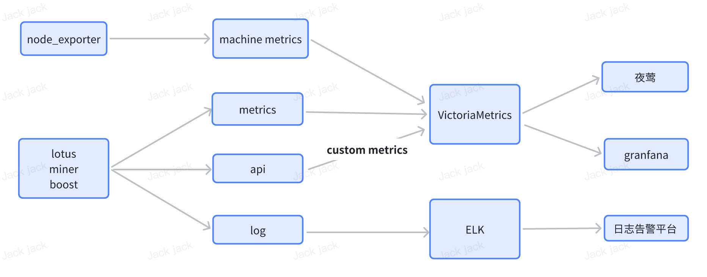

# lotus-monitor
lotus monitor architecture


lotus-monitor 使用 lotus 和 miner 的API，把监控项转化为 prometheus metrics (上图中 custom metrics)

## 功能
- block count
- block took duration
- orphan block 
- orphan block count
- lucky value
- faulty sectors
- active sectors
- live sectors
- current deadline proven cost
- owner/worker/control balance
- sealing jobs timeout count
- sealing jobs count
- miner power
- control address available days

## 部署
```bash
git clone https://github.com/gh-efforts/lotus-monitor.git 
make
./lotus-monitor run --listen=0.0.0.0:6789 --config=./config.json
```
## 配置
配置文件：config.json
- miners  
要监控的miner列表，没有封存任务的，API可设空。  
这个字段可以动态修改，其他字段不支持动态修改。  
修改后，执行 `curl 127.0.0.1:6789/reload` 重载配置文件。（或者lotus-monitor reload）
- running  
sealing jobs 超时记录的阈值  
- recordInterval   
各模块指标采集的频率
- filFoxURL  
查询lucky值的URL 
- orphanCheckHeight   
出块后经过几个高度后再检查是否为孤块（防止链重组），默认为 3
## 命令行
通过命令行或者API管理miner
```bash
➜  lotus-monitor git:(api) ✗ ./lotus-monitor miner
NAME:
   lotus-monitor miner - manage miner list

USAGE:
   lotus-monitor miner command [command options] [arguments...]

COMMANDS:
   add      add new miner
   remove   remove miner
   list     list all miner
   help, h  Shows a list of commands or help for one command
```

## 鸣谢
- https://github.com/s0nik42/lotus-farcaster
- https://github.com/xsw1058/lotus-exporter